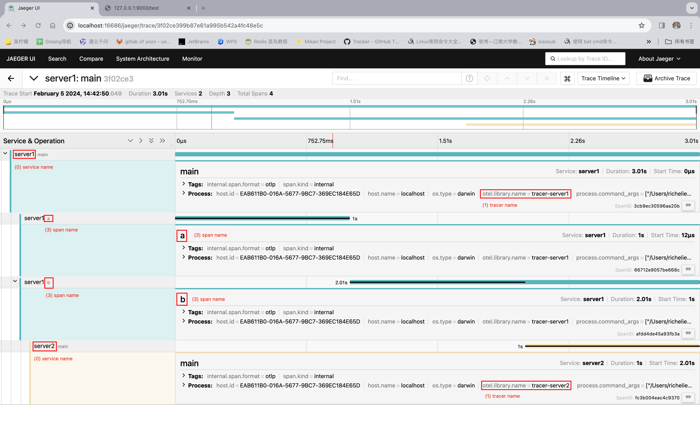
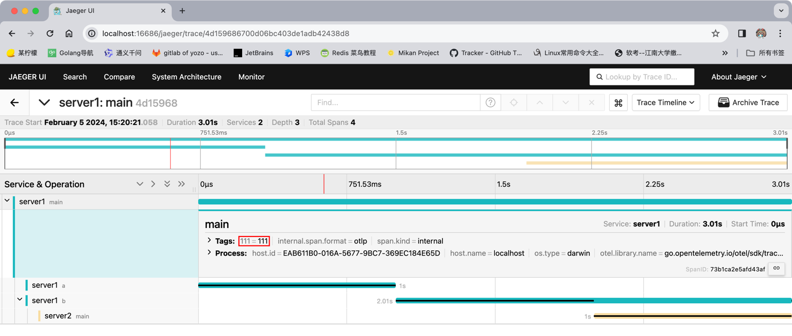

## 参考
- [golang对接OTEL](https://janrs.com/2023/05/k8s-rancher%E9%83%A8%E7%BD%B2open-telemetry%E4%BB%A5%E5%8F%8A%E5%AF%B9%E6%8E%A5elk/#h25)
- notes/micro（微服务）/链路追踪/链路追踪.wps
- notes/micro（微服务）/链路追踪/Jaeger.wps
- notes/micro（微服务）/链路追踪/Jaeger - Golang.wps

## demos
- notes/_GolandProjects/jaeger-demo
- notes/_GolandProjects/jaeger-baggage-demo

## ### 定期任务
更新 resource.go 中的: semconv "go.opentelemetry.io/otel/semconv/v1.23.0"

## service name VS tracer name VS span name
PS: 
- tracer name可以为 "" ，此时会采用默认值 "go.opentelemetry.io/otel/sdk/tracer"; 
- 推荐将 tracer name 置为 "" . 

  

## span
### span 的 attributes
PS: 建议给 span 加上 attributes，这样就可以在UI页面进行搜索了（通过 Tags）.  

e.g.  
```go
tracer := otel.Tracer("")
spanCtx, span := tracer.Start(context.TODO(), "main", trace.WithAttributes(attribute.String("111", "111")))
defer span.End()
```



