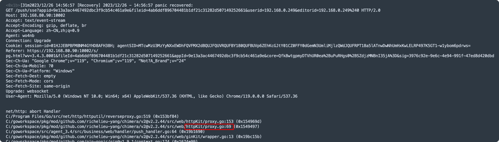

## SSE连接建立成功后，后端应当立即推送一条消息给前端
否则将不会触发前端的onopen.

## !!!: Golang服务代理SSE连接
如果sse连接断开，代理服务会发生panic，如下图：


#### 1种解决方法
在代理服务中，捕获panic，有条件地忽略掉.
```golang
defer func() {
    if obj := recover(); obj != nil {
        if err, ok := obj.(error); ok {
            if strKit.ContainsIgnoreCase(err.Error(), "net/http: abort Handler") {
                // 忽略
                return
            }
        }
        logrus.WithField("obj", obj).Error("panic")
        debug.PrintStack()
    }
}()
```


