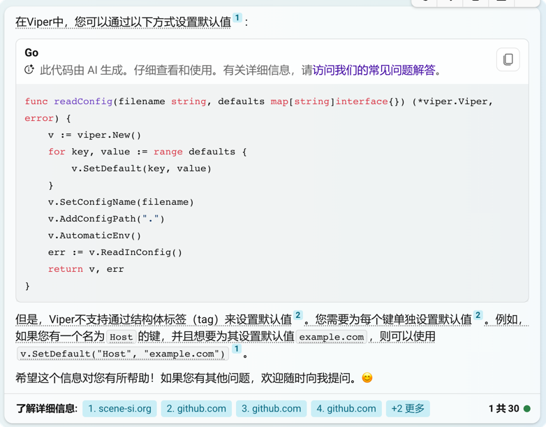

## viper(v1.17.0) 支持读取的配置文件格式
#### viper.go
var SupportedExts = []string{"json", "toml", "yaml", "yml", "properties", "props", "prop", "hcl", "tfvars", "dotenv", "env", "ini"}

## TODO: 默认值
Viper不支持通过结构体标签（tag）来设置默认值.  
  

e.g. 反例，设置默认值失败
type config struct {  
    A int `json:"a,default=1"`  
    B int `json:"b,default=2"`  
    C int `json:"c"`  
}
