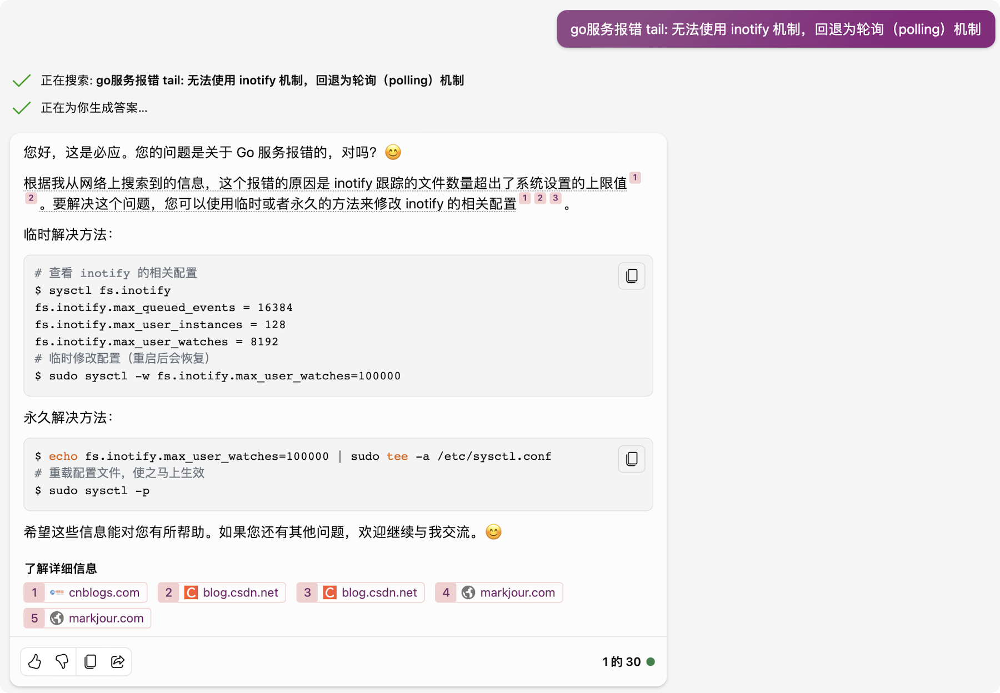

## Linux服务器的推荐配置
PS:
(1) 推荐 永久修改 而非 临时修改!!!
(2) 命令: sh -c "ulimit -a"

#### (1) 单个用户可以创建的进程数上限（线程也算）
ulimit -u: 服务器支持的最大值（最大值通过 ulimit -Hu 命令查看）  

#### (2) core文件的最大值，单位为区块
ulimit -c: unlimited  

#### (3) 同一时间最多可开启的文件数
ulimit -n: 服务器支持的最大值（最大值通过 ulimit -Hn 命令查看）  
e.g.报错  
    too many open files

#### (4) 系统的pid最大值（作为系统范围内 进程 和 线程 总数的限制）
命令:  
    (1) cat /proc/sys/kernel/pid_max  
    (2) sysctl kernel.pid_max  
推荐值: (1) 32位系统: 32768  
       (2) 64位系统: 2000000（200W）  

#### (5) 系统的最大线程数
命令:  
    (1) cat /proc/sys/kernel/threads-max  
    (2) sysctl kernel.threads-max  
推荐值: 352656（参考yozo的服务器）

#### (6) 一个进程可以拥有的最大内存映射区域数量（间接限制了线程数）
命令:
    (1) cat /proc/sys/vm/max_map_count
    (2) sysctl vm.max_map_count
推荐值: 655360（参考yozo的服务器）

#### (7) inotify 相关配置

e.g.报错  
    tail: 无法使用 inotify 机制，回退为轮询（polling）机制：打开的文件过多
