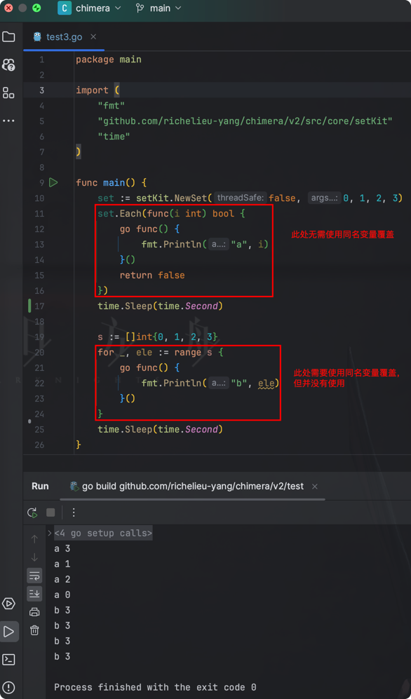

## Set
* 无序
* 不允许重复.

## gset
集合类型-gset
    https://goframe.org/pages/viewpage.action?pageId=1114348

## mapset
### mapset.Set 接口
(1) Cardinality() int   元素个数  
(2) Each(func(T) bool)  遍历（虽然其内部使用了for range，但在使用时无需使用"同名变量覆盖v:=v"）  
        (a) 传参返回true:     中断遍历;  
        (b) 传参返回false:    继续遍历.  

#### Each()源码
虽然其内部使用了for range，但在使用时无需使用"同名变量覆盖v:=v".
  

#### demo
  
