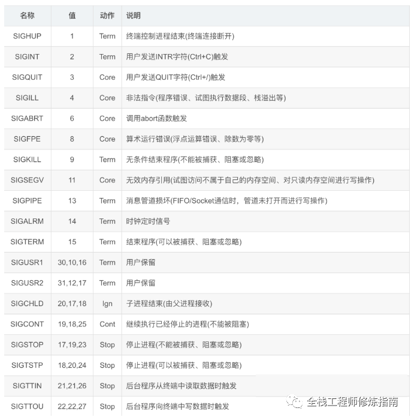

## 参考
- [Golang | Web开发之Gin多服务配置及优雅关闭平滑重启](https://www.jianshu.com/p/3b8b4b3b0b2c)
- [煎鱼 Go Gin 系列七：优雅的重启服务](https://mp.weixin.qq.com/s/MUN8kY3CiKwtRG_Yo22WWQ)

## kill命令
* kill || kill -15: 发送 syscall.SIGTERM 信号
* kill -2: 发送 syscall.SIGINT 信号，我们常用的 Ctrl+C 就是触发系统SIGINT信号
* kill -9: 发送 syscall.SIGKILL 信号（不能被捕获）

## 最常见的信号列表

## 热重载 syscall.SIGHUP

