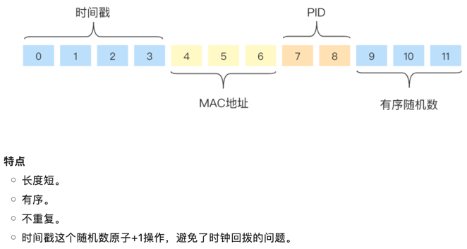

PS: 建议直接使用 ULID.

(1) uuid
uuid的五个版本: https://www.cnblogs.com/xjnotxj/p/12162733.html

(2) nanoid
NanoID 了解一下？比 UUID 更好用！
    https://mp.weixin.qq.com/s/4muEuUkk3tq6iJXLwspQyQ
gonanoid依赖（650 Star）
    https://github.com/matoous/go-nanoid

(3) ULID
ULID - 一种比UUID更好的方案
    https://mp.weixin.qq.com/s/Pr69WMPdGcfE07th0F1CHw

ULID：Universally Unique Lexicographically Sortable Identifier（通用唯一词典分类标识符）
ULID 是既基于时间戳又基于随机数，时间戳精确到毫秒，毫秒内有1.21e + 24个随机数，不存在冲突的风险，而且转换成字符串比 UUID 更加友好。
Format: tttttttttteeeeeeeeeeeeeeee where t is time and e is entropy.

## 参考
10分钟搞定！Golang分布式ID集合  
    https://mp.weixin.qq.com/s/TUsF3SgEgu4VOdosuiPurQ  

## xid
xid是由时间戳、进程id、Mac地址、随机数组成。有序性来源于对随机数部分的原子+1.  

## didi/tinyid
官方中文wiki:  
    https://github.com/didi/tinyid/wiki  

#### 2种访问方式: 
* http方式
* java-client方式

#### Golang访问tinyid

