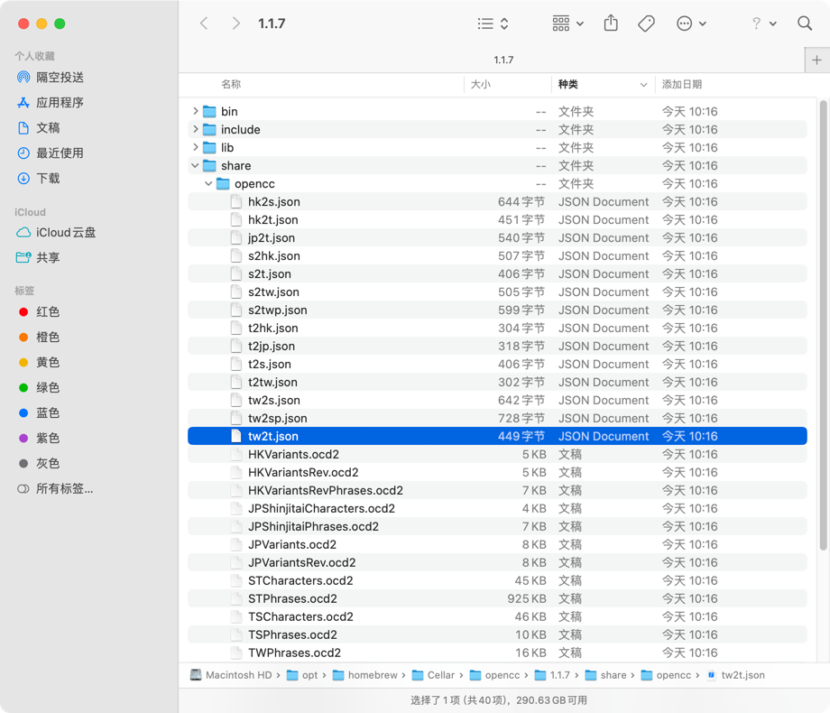

## 参考
- [Golang结合OpenCC实现高效的中文简体繁体互转](https://pylist.com/topic/191.html)

## opencc
#### 安装命令
brew install opencc 

#### json文件

## stevenyao/go-opencc（需要cgo）
- [github](https://github.com/stevenyao/go-opencc)
- 需要先安装opencc

## liuzl/gocc（使用OpenCC的字典，纯go实现）
- [github](https://github.com/liuzl/gocc)

