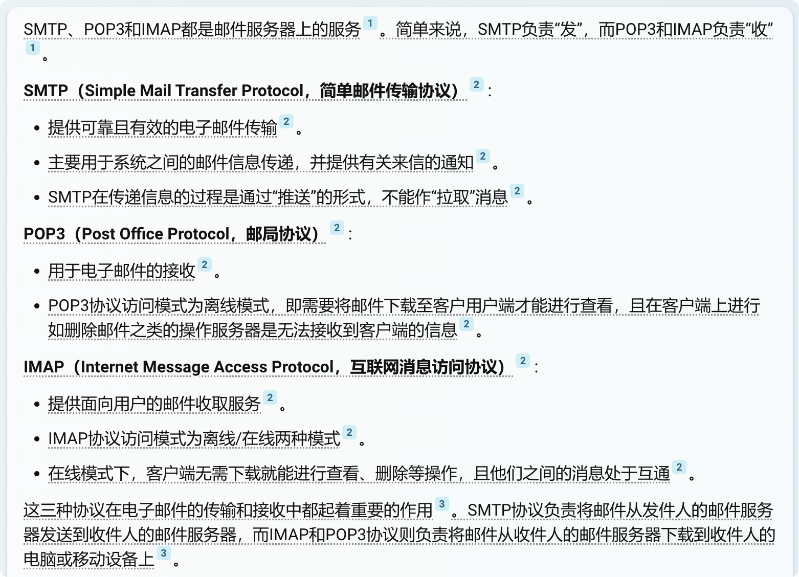

详见: "Golang - 1.docx"。

TODO: imap.go中的并发问题，可以考虑使用"通用连接池"。

## jordan-wright/email 
- [github](https://github.com/jordan-wright/email)
- [Go 每日一库之email](https://darjun.github.io/2020/02/16/godailylib/email/)

## gopkg.in/gomail.v2
- [github](https://github.com/go-gomail/gomail)
- [go-gin-api mail](https://www.yuque.com/xinliangnote/go-gin-api/rwim2a)
- [腾讯云 Golang语言怎么使用gomail库发送邮件？](https://cloud.tencent.com/developer/article/1770771)

## 协议s
PS: 简单来说，SMTP负责“发”，而POP3和IMAP负责“收”。  

- SMTP（Simple Mail Transfer Protocol，简单邮件传输协议）  
- POP3（Post Office Protocol，邮局协议）  
- IMAP（Internet Message Access Protocol，互联网消息访问协议）  

