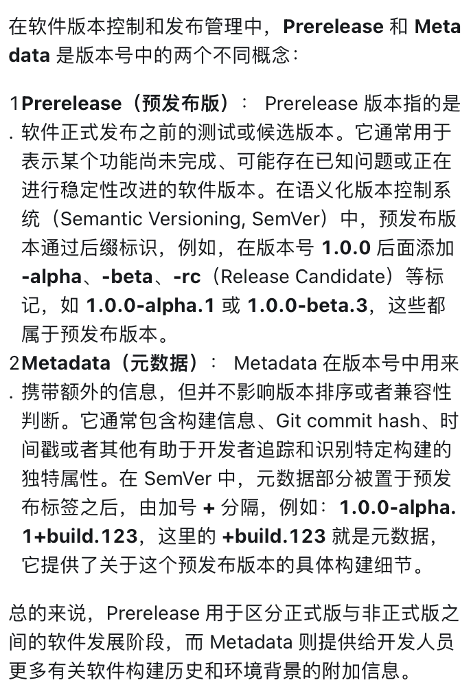

## 第三方库 hashicorp/go-version

#### 参考
- [github(1.5k Star)](https://github.com/hashicorp/go-version)
- [如何使用 Golang 比较版本号大小？](https://mp.weixin.qq.com/s/xIzEac0vQNnjsHdpMv3RQw)

#### 作用
- 比较版本号大小
- 对多个版本号进行排序
- 判断版本号是否在某个范围
- ...

#### Prerelease（预发布版） VS Metadata（元数据）
Prerelease（预发布版）: 用于区分正式版与非正式版之间的软件发展阶段，如 alpha、beta、rc 等。
Metadata（元数据）: 提供给开发人员更多有关软件构建历史和环境背景的附加信息。

